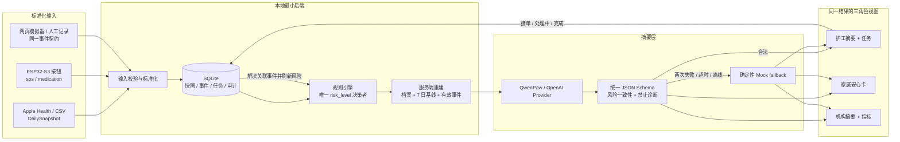

# CareBand v0.2 本地真实闭环架构

## 一条可信主链路

## 不可越过的边界

1. 客户端和硬件不上传 `risk_result`；服务端按快照与有效事件重新计算。
2. LLM 返回的风险等级、分数和理由必须与规则结果完全一致，否则重试一次，再进入 Mock fallback。
3. 所有健康导入先聚合为 `DailySnapshot`；不把原始 Apple Health XML、密钥或精确位置交给 Agent。
4. `TEST001` 是团队测试者证据，必须与机构服务对象运营指标隔离。
5. 家属看到照护状态与必要摘要，不默认看到精确位置、原始语音或敏感故事。
6. 高风险事件、任务状态和 Agent 运行保存审计；AI 不诊断、不建议调整药量。
7. 本地 Demo 可以降级，但必须在界面显示真实 Provider / Mock fallback、验证状态与耗时。

## 规范记录

| 记录 | 最小作用 | 明确不包含 |
| --- | --- | --- |
| `DailySnapshot` | 每日步数、心率聚合、睡眠、佩戴时长、质量 | 原始健康 XML、逐分钟轨迹 |
| `event` | `sos/fall/voice/medication/location/device_status/manual_note` + payload | 客户端决定的风险等级 |
| `task` | 关联事件、负责人、状态和完成记录 | AI 自动宣告“已处理” |
| `agent_run` | Provider、模型、耗时、验证结果、失败原因、限长响应 | API 密钥、原始健康文件、精确位置 |
| `audit` | 关键状态变化和高风险操作 | 与演示无关的个人资料 |

## 本地运行与外部依赖

- 浏览器、Express/SQLite 和 QwenPaw 都运行在本机；ESP32 只访问局域网后端。
- 外部模型是可替换 Provider，不是业务真相来源；断开模型后主闭环仍由规则 + Mock 摘要继续。
- 当前硬件软件可编译不等于实物已验收；只有 `hardware/acceptance.md` 三轮全通过后才能这样表述。
