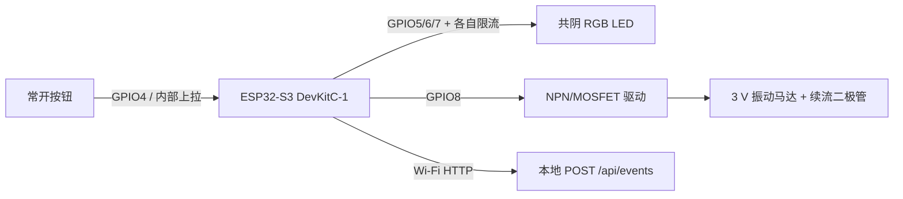

# ESP32-S3 DevKitC-1 接线说明

这是一份低压 USB 供电原型说明，不是量产、电气安全或医疗器械设计。动手前必须按手中开发板的官方针脚图复核 GPIO；若板型或版本不同，修改本地 `include/config_local.h`，不要硬套示例针脚。

## 示例针脚

| 功能 | 示例 GPIO | 接法 |
| --- | ---: | --- |
| 大按钮 | 4 | 一端接 GPIO4，另一端接 GND；固件使用内部上拉，按下为低电平 |
| RGB 红 | 5 | GPIO5 → 220–330 Ω → LED R 脚 |
| RGB 绿 | 6 | GPIO6 → 220–330 Ω → LED G 脚 |
| RGB 蓝 | 7 | GPIO7 → 220–330 Ω → LED B 脚 |
| RGB 共阴 | — | 接 GND |
| 振动控制 | 8 | GPIO8 → 1 kΩ → NPN 基极，或接逻辑级 MOSFET 栅极 |

## 振动马达驱动

```text
ESP32 GPIO8 -- 1 kΩ -- NPN Base
ESP32 GND -------------- NPN Emitter
3.3 V ------------------ Motor +
Motor - ---------------- NPN Collector

续流二极管并联在马达两端：
Cathode（有色环）接 Motor +，Anode 接 Motor -
```

不要把振动马达直接接到 GPIO。所有模块必须共地。若使用 MOSFET，应按所选器件的数据手册调整栅极下拉与接法。

## 逻辑图



## 上电前检查

- [ ] USB 断开时完成接线，确认 3.3 V 与 GND 没有短路。
- [ ] RGB 每一路都有独立限流电阻。
- [ ] 马达通过三极管/MOSFET 驱动并装有续流二极管。
- [ ] 按钮没有占用开发板启动/下载所需针脚。
- [ ] 本地配置的有效电平与实际 LED、按钮和驱动电路一致。
- [ ] 首次上电用 USB 限流电源，并观察是否异常发热。
