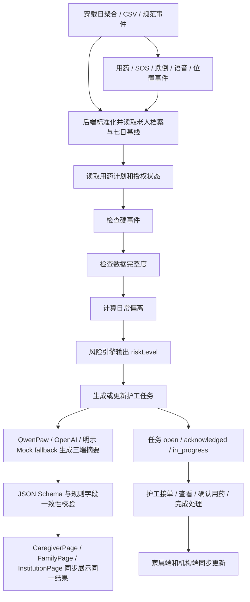

# 事件流说明

## 陈伯主线

1. 初始数据进入系统：步数 820、睡眠 4.8 小时、晚药未确认。
2. 系统读取陈伯个人基线：7 日平均步数 2150、平均睡眠 6.5 小时。
3. 规则引擎输出“需关注”。
4. 20:15 添加语音事件“我有点头晕”。
5. `voice` 事件入库后，规则引擎升级为“高风险”；真实 Provider 或明示 Mock fallback 生成同一次护工、家属、机构摘要。
6. 护工端生成高优先级任务。
7. 护工接单，任务进入处理中。
8. 护工标记已查看，新增 `manual_note` 事件，`payload.action = caregiver_checked`。
9. 护工确认晚药，新增 `medication` 事件，`payload.action = confirmed`。
10. 护工完成处理，任务状态变为 `resolved`；完成时间由服务器生成，并解决关联事件。
11. 家属端和机构端同步显示“已跟进 / 持续观察”，同时保留“今日曾出现高风险事件”的说明。
